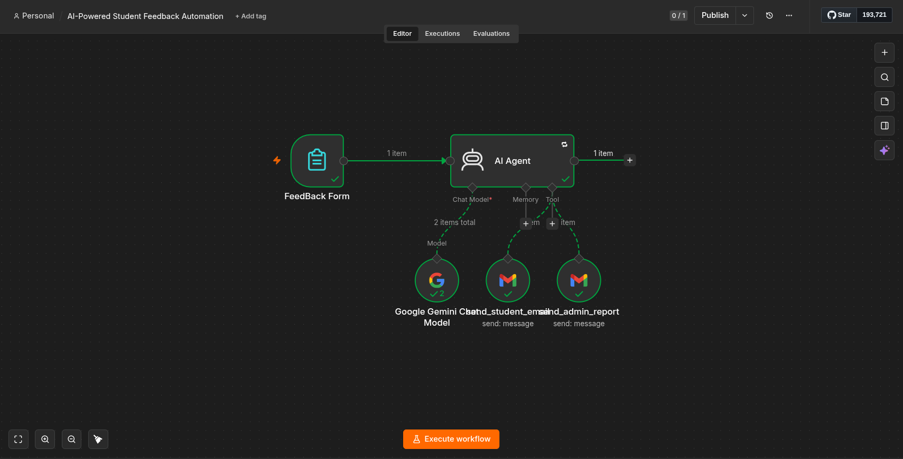
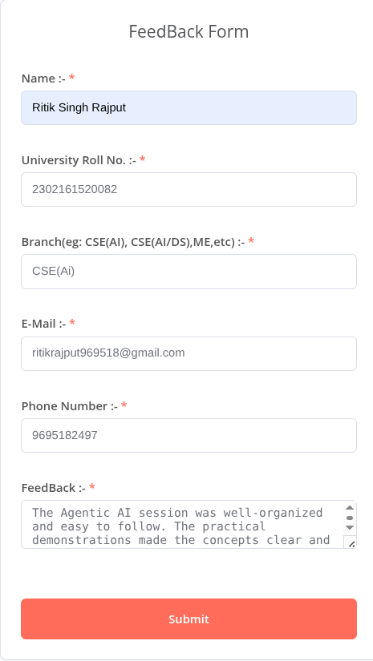
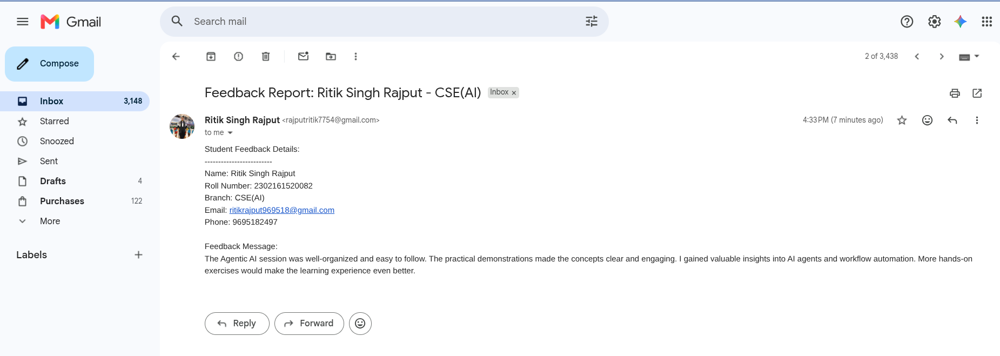
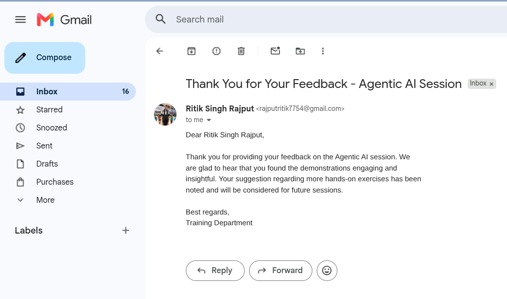

# 🤖 Agentic AI Feedback Management System


An **AI-powered feedback management system** built with **n8n**, **Google Gemini**, and **Gmail** that automates student feedback processing. The AI agent analyzes feedback, generates personalized thank-you emails, creates administrator reports, and uses Gmail tools to send emails automatically.

---

## 🚀 Features

- 📝 Collect student feedback through an n8n Form Trigger
- 🤖 AI-powered feedback analysis using Google Gemini
- 💌 Automatically sends personalized thank-you emails to students
- 📧 Sends detailed feedback reports to the administrator
- 🧠 AI-generated sentiment analysis
- 📋 AI-generated feedback summary
- ⚡ Fully automated workflow using n8n AI Agent
- 🔧 Uses Gmail as AI Tools for autonomous email sending

---

# 🛠 Tech Stack

| Technology | Purpose |
|------------|---------|
| n8n | Workflow Automation |
| Google Gemini | AI Model |
| Gmail | Email Automation |
| AI Agent | Tool Calling |
| Simple Memory | Context Management |
| n8n Form Trigger | Feedback Collection |

---

# 🏗 Workflow Architecture

```text
                 Student

                    │
                    ▼

           Feedback Form (n8n)

                    │
                    ▼

               AI Agent (Gemini)

          ┌─────────┴─────────┐

          ▼                   ▼

 Send Student Email     Send Admin Report
      (Gmail)               (Gmail)

          │                   │

          ▼                   ▼

 Student Receives       Administrator Receives
 Thank You Email         Feedback Report
```

---

# 📷 Screenshots

## Workflow



---

## Feedback Form



---

## Student Thank You Email



---

## Administrator Report



---

# 📂 Project Structure

```
agentic-ai-feedback-management/

│

├── README.md

├── workflow/

│ └── agentic_ai_feedback_management.json

│

├── screenshots/

│ ├── workflow.png

│ ├── feedback_form.png

│ ├── student_email.png

│ └── admin_email.png

│

└── assets/

```

---

# ⚙️ Installation

## 1 Clone Repository

```bash
git clone https://github.com/YOUR_USERNAME/agentic-ai-feedback-management.git
```

---

## 2 Open n8n

Run n8n locally or using Docker.

---

## 3 Import Workflow

Import

```
workflow/agentic_ai_feedback_management.json
```

into n8n.

---

## 4 Configure Credentials

Configure:

- Google Gemini API
- Gmail OAuth2

---

## 5 Execute Workflow

Submit the feedback form.

The workflow will automatically:

- Analyze the feedback
- Send a thank-you email to the student
- Send a detailed report to the administrator

---

# 📋 Example Workflow

1. Student submits feedback.
2. n8n receives the submission.
3. Gemini analyzes the feedback.
4. AI Agent generates:
   - Student thank-you email
   - Administrator report
5. Gmail tools automatically send both emails.

---

# 📈 Future Enhancements

- Google Sheets integration
- Database support (PostgreSQL/MySQL)
- Slack notifications
- Microsoft Teams integration
- AI-powered feedback categorization
- Dashboard using Power BI or Looker Studio
- Weekly automated feedback reports
- PDF report generation
- Multi-language email support
- Email templates with HTML styling

---

# 💡 Learning Outcomes

This project demonstrates:

- Agentic AI
- AI Tool Calling
- Prompt Engineering
- Workflow Automation
- Gmail Integration
- Google Gemini Integration
- AI-powered Email Automation
- n8n AI Agent Development

---

# 🤝 Contributing

Contributions, suggestions, and improvements are welcome!

1. Fork the repository.
2. Create a feature branch.
3. Commit your changes.
4. Open a Pull Request.

---

# 📜 License

This project is licensed under the MIT License.

---

# 👨‍💻 Author

**Ritik Singh Rajput**

- GitHub: https://github.com/Rajputritik9695
- LinkedIn: *(https://www.linkedin.com/in/ritik-singh-rajput-49b964319/)*

---

⭐ If you found this project useful, consider giving it a star!
